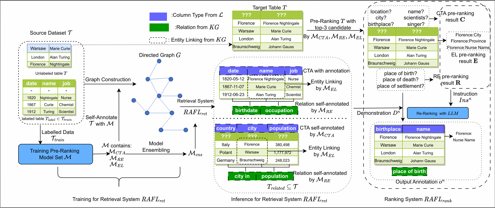

## RAFL:A Retrieval-Augmented Framework for Tabular Interpretation with Large Language Model

This is the code and necessary files for our paper: A Retrieval-Augmented Framework for Tabular Interpretation with Large Language Model

### Requirements

Please check [LLaMa-Factory](https://github.com/hiyouga/LLaMA-Factory) and [FlagEmbedding](https://github.com/FlagOpen/FlagEmbedding) for the requirements.



An example of a relational table from Wikipedia. 

The above part contains the table metadata $T_m$ and the table cells $T.E$. 

The middle part illustrates examples of three table interpretation tasks $\kappa$.  e.g. 
 - *CTA*: Decide the column type for column *CITY*; 
 - *EL*: Choose the KG entity linked with cell *Suisse*; 
 - *RE*: Decide the *KG* relation for column pair (Team-P).
 
 The latter part presents how we organize the task-specific instruction for LLM, to provide the final output $o^{\kappa}$ for each task. 
 
 We highlight the key components for LLM instruction, and they are vital to guide LLM to output proper answer.

### Data Preparation

Please check [RECA](https://github.com/ysunbp/RECA-paper) and [TURL](https://github.com/sunlab-osu/TURL) for data preparation. The Detailed data is organized as follows:

- SimWeb2019: Download from [RECA](https://github.com/ysunbp/RECA-paper),or directory from this [link](https://drive.google.com/file/d/1UtSAhSjnJernYbjcB_x0l859AU5xTKDN/view),  and we provide the raw and processed version in `data/SimWeb` folder
- WebTable: Download from [RECA](https://github.com/ysunbp/RECA-paper), or directory from this [link](https://github.com/megagonlabs/sato/tree/master/table_data). Put the sato_table folder in `data/webtable` folder.
- WIKIGS-RE/WIKIGS-RE: Please check [TURL](https://github.com/sunlab-osu/TURL) or check this [link](https://buckeyemailosu-my.sharepoint.com/personal/deng_595_buckeyemail_osu_edu/_layouts/15/onedrive.aspx?ga=1&id=%2Fpersonal%2Fdeng%5F595%5Fbuckeyemail%5Fosu%5Fedu%2FDocuments%2FBuckeyeBox%20Data%2FTURL%2Fdata), and download the
```
dev.table_entity_linking.json
dev.table_rel_extraction.json
dev_tables.jsonl

test.table_rel_extraction.json
test_own.table_entity_linking.json
test_tables.jsonl

train.table_entity_linking.json
train.table_rel_extraction.json
train_tables.jsonl

```
and put then in `data/REL`. We also provide the processed version for RE task in `data/RE`, EL task in `data/EL` seperately.
### Data Proprocess
### Pre-ranking Model Training
### Re-Ranking Model Training 